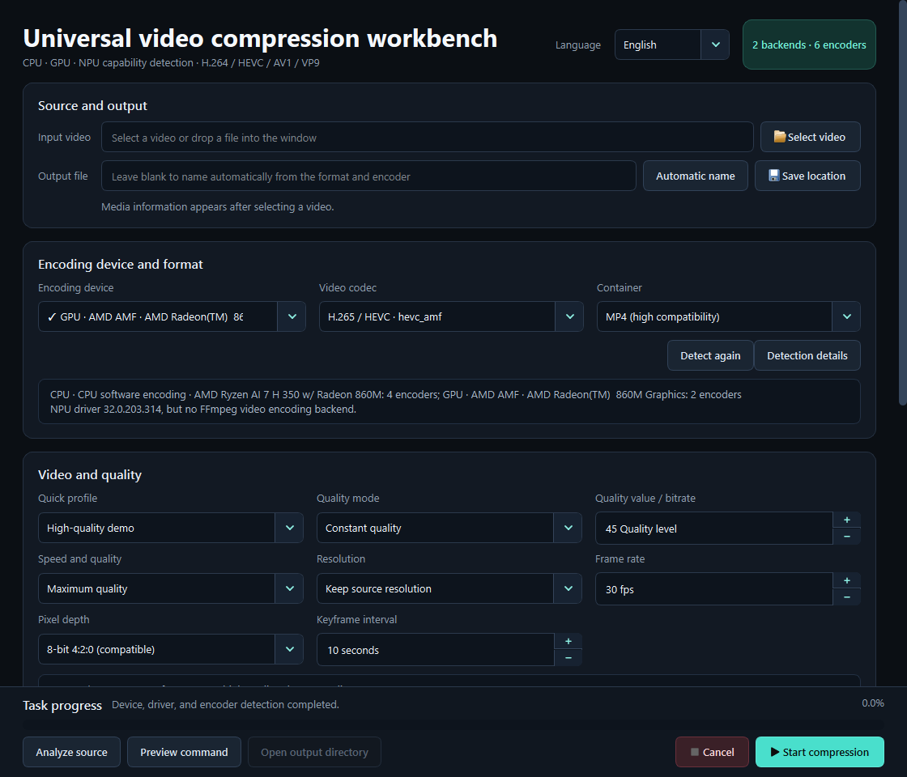

# Universal Video Compressor

**English** | [简体中文](README.zh-CN.md)

[](https://github.com/expire5853/universal-video-compressor/releases/latest)

[](https://github.com/expire5853/universal-video-compressor/actions/workflows/ci.yml)
[](https://github.com/expire5853/universal-video-compressor/actions/workflows/codeql.yml)


Universal Video Compressor is a Windows desktop application for reducing video file size with CPU or GPU encoding. It detects the hardware and drivers on the current computer, then shows only encoder options that pass a real test.

> **New user?** Download the **Full** edition. It runs without a separate FFmpeg installation.



## Download and start

The packaged application supports Windows 10 and 11. It is portable: download an EXE and run it without an installer. Python is not required.

**[Open the latest release](https://github.com/expire5853/universal-video-compressor/releases/latest)**

On the release page, open **Assets** and choose one of these two editions of the same application:

| Edition | File to download | What it contains | Approximate size | Choose it when |
|---|---|---|---:|---|
| **Full** | `VideoCompressor-Full.exe` | Application, FFmpeg, and FFprobe | 142 MiB | You want the simplest option or do not manage FFmpeg yourself |
| **Lite** | `VideoCompressor-Lite.exe` | Application only | 21 MiB | Working FFmpeg and FFprobe commands are already installed on your computer |

Both editions provide the same application features. Each release provides the two EXE files directly. When matching Full/Lite ZIP files are also listed, they contain the same executable together with README and license files.

### Which edition should I choose?

Choose **Full** if you are unsure. Its larger size comes from the included FFmpeg and FFprobe tools.

Consider **Lite** only after confirming that both tools are already available. Open PowerShell and run:

```powershell
Get-Command ffmpeg.exe, ffprobe.exe -ErrorAction Stop
ffmpeg -hide_banner -version
ffprobe -hide_banner -version
```

- If every command prints a path or version, Lite can use that installation.
- If any command says the program was not found, use Full.
- Advanced users can point Lite to another installation with `FFMPEG_PATH` or `--ffmpeg`.

The edition does not determine whether GPU acceleration works. AMD, NVIDIA, or Intel encoding still requires a compatible graphics device and working driver; the application verifies the encoder after startup.

### First run

1. Download one EXE, or download and extract the matching ZIP when available.
2. Run `VideoCompressor-Full.exe` or `VideoCompressor-Lite.exe`.
3. Wait for device and encoder detection to finish.
4. Select a source video, choose the available format and quality options, then start compression.

The current executables are unsigned, so Windows SmartScreen may display a warning. Verify that the file came from this repository and check its SHA-256 value before allowing it to run.

## What the application can do

- Use CPU software encoding or a verified AMD, NVIDIA, or Intel GPU encoder.
- Create H.264/AVC, H.265/HEVC, AV1, or VP9 video where the selected backend supports it.
- Write MP4, MKV, WebM, or MOV files using compatible codec combinations.
- Choose a quick profile or manually control quality mode, speed, resolution, frame rate, 8/10-bit output, and keyframe interval.
- Copy compatible source audio, encode AAC/Opus/FLAC, or remove audio.
- Preview the FFmpeg command before starting.
- Write to a partial file, verify the output with FFprobe, and publish it atomically only after validation succeeds.
- Use an English or Simplified Chinese interface.

## Hardware and encoder availability

Seeing an encoder in `ffmpeg -encoders` is not enough. The application separately checks the device, driver, FFmpeg build, encoder initialization, output container, pixel depth, and FFprobe result.

| Device | Backend | Candidate codecs | When it becomes selectable |
|---|---|---|---|
| CPU | Software | H.264, HEVC, AV1, VP9 | Encoder, container, and probe test succeeds |
| AMD GPU | AMF | H.264, HEVC, AV1 | AMD device/driver and AMF test succeed |
| NVIDIA GPU | NVENC | H.264, HEVC, AV1 | NVIDIA device/driver and NVENC test succeed |
| Intel GPU | QSV | H.264, HEVC, AV1, VP9 | Intel device/driver and QSV test succeed |
| NPU | Runtime-specific | None in the bundled FFmpeg build | Shown for diagnostics, but not selectable for encoding |

Quality modes and 8/10-bit combinations are tested independently. One failed combination is hidden without disabling combinations that do work.

## Important limitations

- The current version compresses the first video stream and the first audio stream.
- Additional audio tracks, subtitle streams, and attachments are not copied.
- Chapter and container-metadata preservation can depend on the selected output format.
- NPU devices are detected for diagnostics, but the bundled FFmpeg currently has no NPU video-encoding backend.

Review the preview command before processing archival, subtitled, or multi-language media.

## Language and detailed help

On the first launch, Chinese Windows installations use Simplified Chinese and other systems use English. Select **English** or **简体中文** in the application header to save a different language for the next launch. Command-line users can override it with `--language en` or `--language zh_CN`.

- [Detailed English usage guide](docs/usage.md)
- [Simplified Chinese usage guide](docs/usage.zh-CN.md)
- [Hardware validation status](docs/hardware-validation.md)

## Verify a release download

Every release provides `SHA256SUMS.txt`. Calculate the SHA-256 value of the downloaded EXE or ZIP and compare it with the matching line in that file.

Releases produced by the current workflow also receive a GitHub build-provenance attestation. GitHub CLI users can verify an attested asset with:

```powershell
gh attestation verify .\VideoCompressor-Full.exe `
  --repo expire5853/universal-video-compressor
```

## For developers

Ordinary release users can stop here. The following sections are for source builds and project contributors.

### Run from source

Requirements:

- Windows 10 or 11;
- Python 3.12 or 3.13 managed through [uv](https://docs.astral.sh/uv/);
- FFmpeg and FFprobe on `PATH`, unless an explicit FFmpeg path is supplied.

```powershell
git clone https://github.com/expire5853/universal-video-compressor.git
cd universal-video-compressor
uv sync --frozen
uv run video-compressor
```

Open a video directly or generate a machine-readable capability report:

```powershell
uv run video-compressor "C:\Videos\demo.mp4"

uv run python -m video_compressor `
  --diagnostics-report diagnostics.json `
  --self-test
```

### Build the Windows packages

```powershell
powershell -ExecutionPolicy Bypass `
  -File .\scripts\build_windows.ps1 `
  -Mode OneFile `
  -Edition Both
```

Build outputs include the Full/Lite executables, matching ZIP packages, license files, and `SHA256SUMS.txt` under `artifacts`. Use `-Edition Full` or `-Edition Lite` to build one edition. Full builds accept `-FfmpegPath` when the tools cannot be discovered automatically.

### Checks and project documentation

```powershell
uv sync --frozen --group dev
uv run ruff format --check src tests scripts
uv run ruff check src tests scripts
uv run python -m unittest discover -s tests -v
```

- [Contributing guide](CONTRIBUTING.md)
- [Architecture](docs/architecture.md)
- [Release process](docs/releasing.md)
- [Security policy](SECURITY.md)

## Legacy presets

The original AMD AMF PowerShell and Textual implementations are preserved under [`legacy/amd-amf`](legacy/amd-amf). They are hardware-specific and are not used by the modern generic GUI.

## License and FFmpeg

This project is licensed under GPL-3.0-only. Portable releases may bundle a separately executed GPL-enabled FFmpeg build and include its license alongside the executable. See [THIRD_PARTY_NOTICES.md](THIRD_PARTY_NOTICES.md) and the [FFmpeg legal page](https://ffmpeg.org/legal.html).

This repository does not provide legal advice. Distributors are responsible for checking the licenses and patent rules that apply in their jurisdiction.
