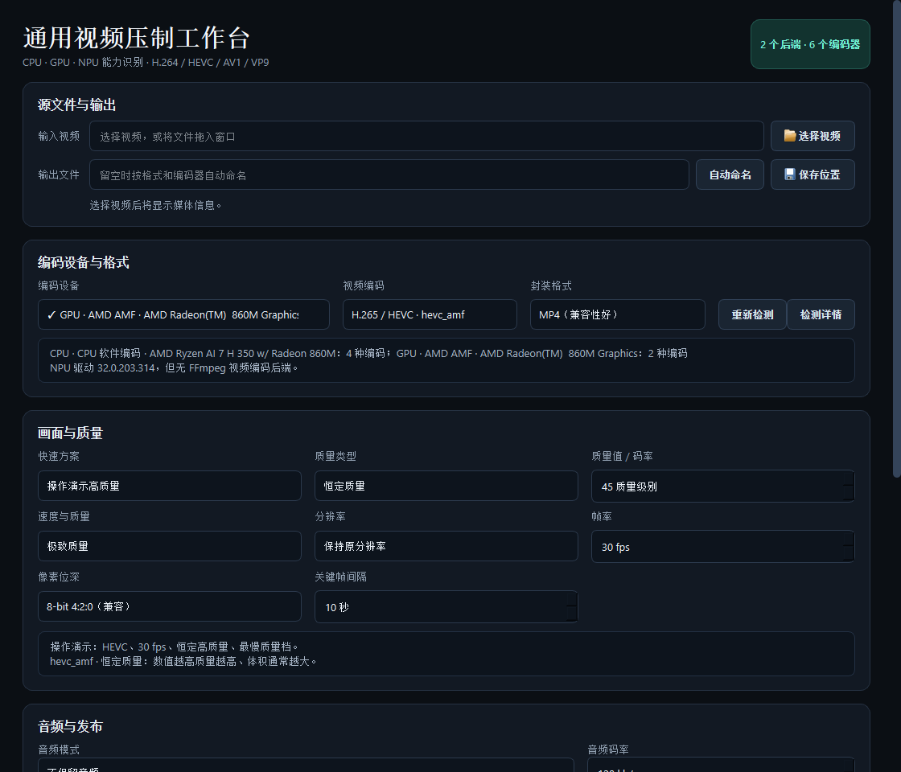

# Universal Video Compressor


A modern Windows video compression workbench built with PySide6 and FFmpeg. It detects CPU, GPU, and NPU devices, checks their drivers, and verifies every selectable encoder with a real encode-and-probe test.

一个面向 Windows 的现代视频压制工作台。它不会把“FFmpeg 列出了编码器”误认为“本机能够编码”，而是依次验证设备、驱动、编码器初始化、输出尺寸和 FFprobe 回读结果。



## Highlights

- CPU software encoding: x264, x265, SVT-AV1, and VP9.
- GPU backends: AMD AMF, NVIDIA NVENC, and Intel Quick Sync Video.
- NPU visibility: reports the device and driver but keeps NPU disabled when no FFmpeg video backend exists.
- Video codecs: H.264/AVC, H.265/HEVC, AV1, and VP9.
- Containers: MP4, MKV, WebM, and MOV.
- Quality controls: constant quality, CQP, VBR, and CBR, filtered by the selected backend and pixel depth.
- Audio: compatible stream copy, AAC, Opus, FLAC, or removal.
- Safe publishing: writes to a partial file, verifies the result, and then publishes atomically.
- Portable Windows release: Nuitka OneFile builds can include FFmpeg and FFprobe.

## Capability model

| Device | Backend | Candidate codecs | Availability rule |
|---|---|---|---|
| CPU | Software | H.264, HEVC, AV1, VP9 | Encoder, mux, and probe test succeeds |
| AMD GPU | AMF | H.264, HEVC, AV1 | AMD device/driver and AMF test succeed |
| NVIDIA GPU | NVENC | H.264, HEVC, AV1 | NVIDIA device/driver and NVENC test succeed |
| Intel GPU | QSV | H.264, HEVC, AV1, VP9 | Intel device/driver and QSV test succeed |
| NPU | Runtime-specific | None in the bundled FFmpeg build | Displayed for diagnostics; not selectable |

The UI also tests quality-mode and 8/10-bit combinations. A failing combination is hidden without disabling the combinations that do work.

## Quick start from source

Requirements:

- Windows 10 or 11;
- [uv](https://docs.astral.sh/uv/);
- FFmpeg and FFprobe on `PATH`, unless an explicit FFmpeg path is supplied.

```powershell
cd universal-video-compressor
uv sync --frozen
uv run video-compressor
```

Open a video directly:

```powershell
uv run video-compressor "C:\Videos\demo.mp4"
```

Generate a machine-readable capability report:

```powershell
uv run python -m video_compressor `
  --diagnostics-report diagnostics.json `
  --self-test
```

Detailed Chinese instructions are available in [docs/usage.zh-CN.md](docs/usage.zh-CN.md).

## Build a portable Windows executable

```powershell
powershell -ExecutionPolicy Bypass `
  -File .\scripts\build_windows.ps1 `
  -Mode OneFile
```

The output is written to `artifacts/onefile/VideoCompressor.exe`. Use `-BundleFfmpeg:$false` for a smaller executable that relies on the target machine's FFmpeg installation.

## Development

```powershell
uv sync --frozen --group dev
uv run ruff format --check src tests
uv run ruff check src tests
uv run python -m unittest discover -s tests -v
```

See [CONTRIBUTING.md](CONTRIBUTING.md) for hardware-test expectations and pull-request guidance. The internal design is documented in [docs/architecture.md](docs/architecture.md), and the release process in [docs/releasing.md](docs/releasing.md).

## Legacy presets

The original AMD AMF PowerShell and Textual implementations are preserved under [`legacy/amd-amf`](legacy/amd-amf). They are hardware-specific and are not used by the modern generic GUI.

## License and FFmpeg

This project is licensed under GPL-3.0-only. Portable releases may bundle a separately executed GPL-enabled FFmpeg build and include its license alongside the executable. See [THIRD_PARTY_NOTICES.md](THIRD_PARTY_NOTICES.md) and the [FFmpeg legal page](https://ffmpeg.org/legal.html).

This repository does not provide legal advice. Distributors are responsible for checking the licenses and patent rules that apply in their jurisdiction.
