# Architecture

## Runtime pipeline

```mermaid
flowchart LR
    A["Enumerate CPU, GPU, and NPU"] --> B["Read device and driver state"]
    B --> C["Match FFmpeg encoder candidates"]
    C --> D["Encode a generated frame"]
    D --> E["Mux and inspect with FFprobe"]
    E --> F["Expose only validated options"]
    F --> G["Encode to a partial output"]
    G --> H["Verify streams and geometry"]
    H --> I["Atomically publish output"]
```

Presence and availability are deliberately different states. A device can exist with a driver while having no usable FFmpeg video backend. Likewise, a compiled encoder can fail initialization on the current hardware.

## Package layout

- `video_compressor.core`: immutable catalogs, device enumeration, capability probing, FFmpeg command generation, progress parsing, verification, and atomic publication.
- `video_compressor.gui`: PySide6 widgets, asynchronous detection and encoding workers, dynamic option filtering, presets, logs, and diagnostics entry points.
- `video_compressor.__main__`: module entry point.
- `tests`: deterministic command-generation and compatibility tests that do not require encoder hardware.
- `scripts`: icon generation and reproducible Windows packaging.
- `legacy/amd-amf`: the earlier AMD-specific scripts, isolated from the generic application.

## Capability invariants

1. A backend is selectable only when its device is present and at least one encoder passes runtime verification.
2. A codec is selectable only when it is compatible with both the backend and container.
3. Pixel depth and quality modes are filtered by the exact combination tested at startup.
4. NPU presence is reported independently from video-encoding support.
5. Source audio may be copied only when the destination container accepts the codec.

## Output safety

Encoding targets a uniquely named `.partial` file. The application probes that file and verifies the expected video codec, geometry, and audio presence. Only then does it use an atomic replacement to publish the requested destination. Cancellation and exceptions remove the partial file.
